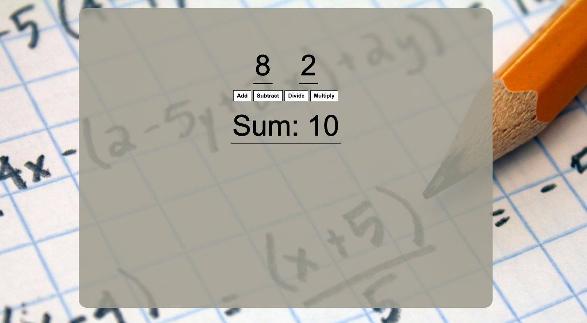

# A simple 8 & 2 digits demo calculator

### A demo application, implementing JavaScript DOM manipulation in an 8 & 2 digits only calculator. It performs addition, mutltiplication, subtraction and division mathematical operations.

